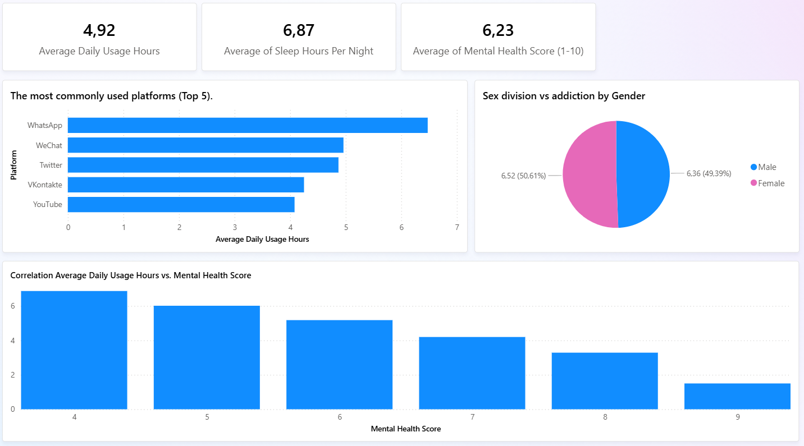
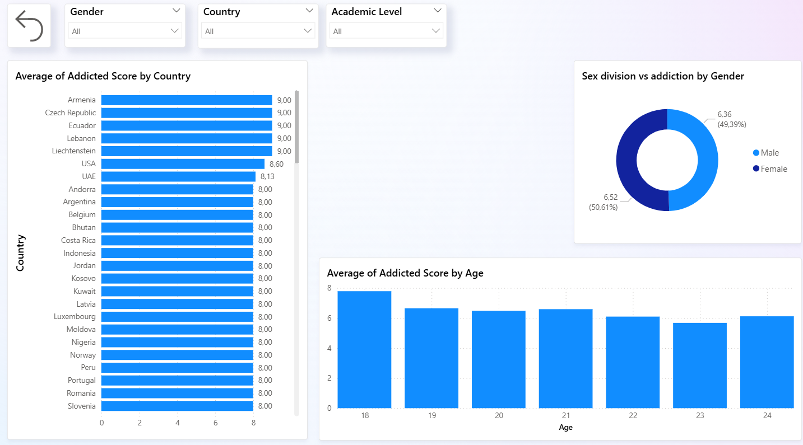
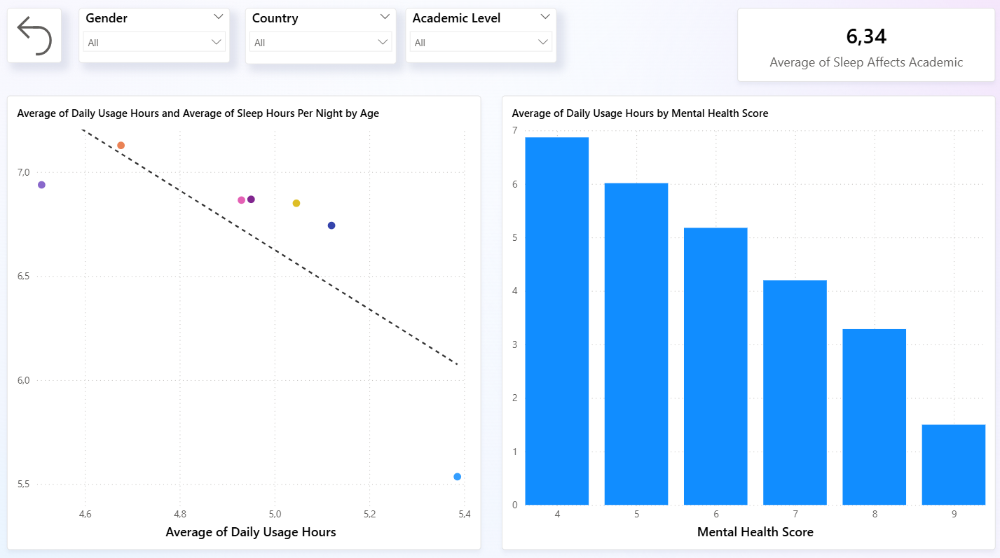
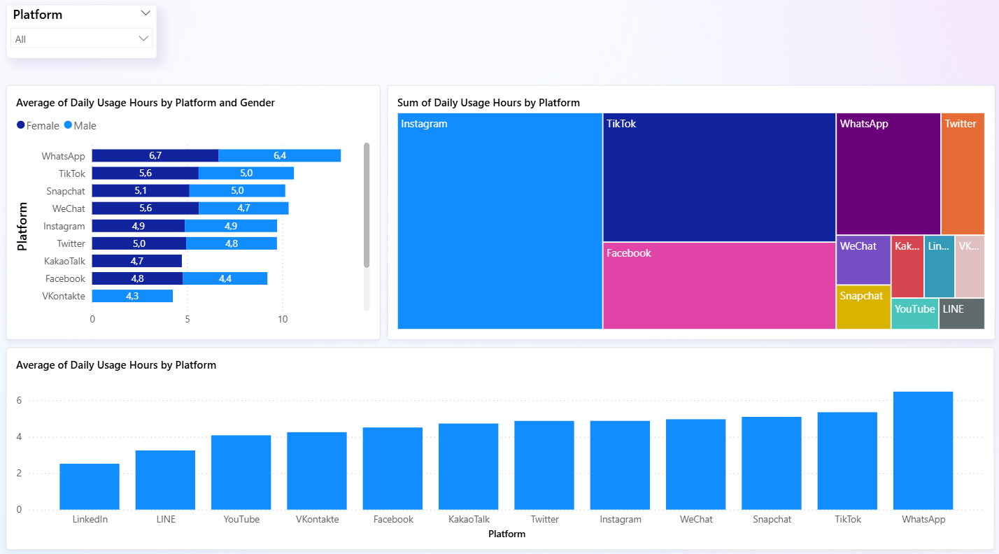

**# Social-Media-Measures
This dashboard explores the relationship between social media usage and mental well-being among students. It combines data on daily screen time, mental health self-assessments, addiction levels, and demographic information (age, gender, country). The report identifies patterns across platforms and demographics, helping to understand how different usage behaviors correlate with sleep quality and mental health.

## Highlights
- Showcased most used platforms and average time spent
- Compared mental health scores by screen time and country
- Evaluated gender-based differences in addiction and platform preferences
- Linked age and academic level with social media use and sleep habits

## Overview

## Demographics & Addiction

## Impact on Well-being

## Platform Insights

